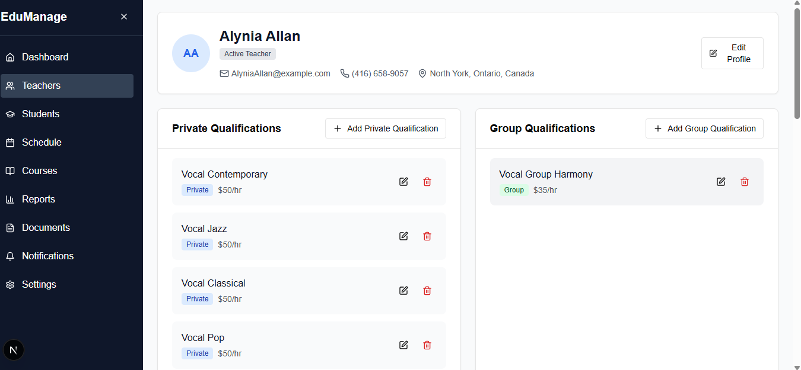
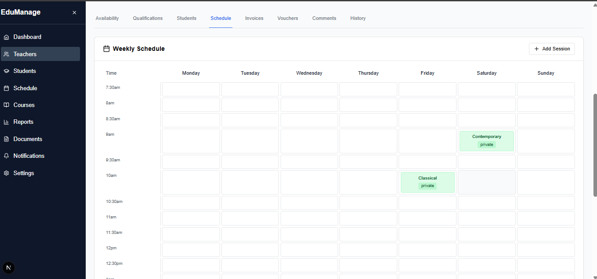

# Teacher Management Interface

A modern, responsive teacher management interface built with Next.js, TypeScript, and Tailwind CSS.

## Features

- **Modern UI/UX**: Clean, contemporary design with smooth transitions
- **Responsive Design**: Mobile-first approach that works on all devices
- **TypeScript**: Full type safety throughout the application
- **Component Architecture**: Modular, reusable components
- **Accessibility**: WCAG compliant with proper ARIA labels and keyboard navigation

## Tech Stack

- **Next.js 14** - React framework for production
- **TypeScript** - Type safety and better developer experience
- **Tailwind CSS** - Utility-first CSS framework
- **Lucide React** - Modern icon library

## Getting Started

### Prerequisites

- Node.js 18+ 
- npm or yarn

### Installation

1. Clone the repository:
\`\`\`bash
git clone <repository-url>
cd teacher-management-interface
\`\`\`

2. Install dependencies:
\`\`\`bash
npm install
# or
yarn install
\`\`\`

3. Run the development server:
\`\`\`bash
npm run dev
# or
yarn dev
\`\`\`

4. Open [http://localhost:3000](http://localhost:3000) in your browser.

## Project Structure

\`\`\`
src/
├── app/
│   ├── layout.tsx          # Root layout
│   └── page.tsx            # Main teacher management page
├── components/
│   ├── Sidebar.tsx         # Navigation sidebar
│   ├── TeacherHeader.tsx   # Teacher profile header
│   ├── QualificationsCard.tsx # Qualifications management
│   ├── ScheduleGrid.tsx    # Weekly schedule grid
│   └── TabNavigation.tsx   # Tab navigation component
├── types/
│   └── teacher.ts          # TypeScript type definitions
└── lib/
    └── utils.ts            # Utility functions
\`\`\`

## Key Components

### Sidebar
- Collapsible navigation menu
- Active state management
- Responsive design for mobile

### Teacher Header
- Profile information display
- Action buttons for editing
- Contact information layout

### Qualifications Management
- Separate cards for private and group qualifications
- Add/edit/delete functionality
- Rate display and management

### Schedule Grid
- Weekly calendar view
- Time slot management
- Visual indicators for different session types
- Responsive horizontal scrolling

## Design Decisions

1. **Color Scheme**: Used a professional blue and gray palette for trust and clarity
2. **Typography**: Clear hierarchy with proper font weights and sizes
3. **Spacing**: Consistent spacing using Tailwind's spacing scale
4. **Interactive Elements**: Hover states and smooth transitions for better UX
5. **Mobile Responsiveness**: Grid layouts that adapt to different screen sizes

## Accessibility Features

- Proper ARIA labels and roles
- Keyboard navigation support
- Color contrast compliance
- Screen reader friendly structure
- Focus management

## Performance Optimizations

- Component-based architecture for code splitting
- Optimized images and assets
- Minimal bundle size with tree shaking
- Efficient re-rendering with React best practices

## Future Enhancements

- Real-time updates with WebSocket integration
- Advanced filtering and search functionality
- Drag-and-drop schedule management
- Export functionality for schedules and reports
- Integration with payment systems
- Multi-language support

## Contributing

1. Fork the repository
2. Create a feature branch
3. Make your changes
4. Add tests if applicable
5. Submit a pull request

## Preview 

\`\`\`
